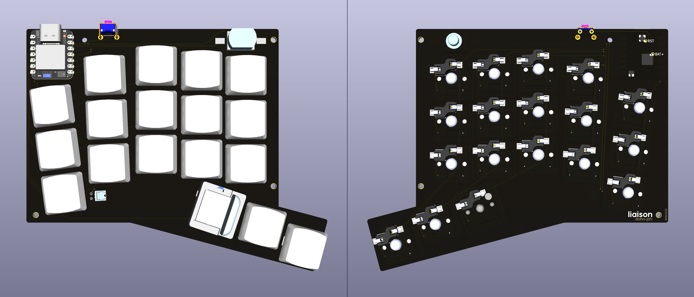
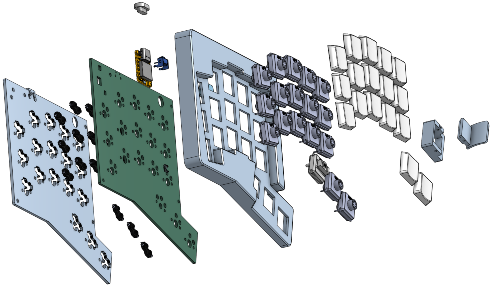

# Liaison
`Liaison` is a wireless 36-key split keyboard that leverages custom keycaps, splay, and tenting for ergonomics.

**Video showcase**:  
[Fit and layout](https://vimeo.com/1022366207)  
[Typing test](https://vimeo.com/1022366241)

***

# Components

## Case and Tenting Legs
[Here](case) you can find models for the case and magsafe tenting legs.  
Print 1 of each of the following:
* [top left](case/case_top_left.step)
* [top right](case/case_top_right.step)
* [bottom left](case/case_bottom_left.step)
* [bottom right](case/case_bottom_right.step)

[Tenting legs](case/magsafe_tenting_leg) (optional)
[Dongle case](https://github.com/dohn-joh/dongle-zmk) (optional)

## Required Parts
|Part|Quantity|Link|
|-|:-:|-|
|Microcontroller: Xiao nRF52840|1|https://www.seeedstudio.com/Seeed-XIAO-BLE-nRF52840-p-5201.html|
|Battery: 301230 with molex pico ezmate connector|1|Select L0040. https://www.aliexpress.us/item/3256802674181210.html|
|Battery connector: molex pico ezmate 1x02|1|Select 2P. https://www.aliexpress.us/item/3256805726980487.html|
|Power button: 1208YD|1|https://www.aliexpress.us/item/3256801267126259.html|
|Reset button: SKHLLCA010|1|https://www.aliexpress.us/item/3256805176534062.html|
|M2 heatset inserts (OD:3.2, Height: 2-3mm)|8|https://www.aliexpress.us/item/3256804856964661.html|
|Switches|36|Your choice of choc v1 or v2. Recommended: Lofree ghost, swap springs|
|Kailh Choc PG1350 Hot Swap Sockets|36|https://www.aliexpress.us/item/3256803687338432.html|
|Silicone sheet for feet|1|https://www.amazon.com/dp/B09NW63JLC|
|Keycaps|36|Your choice. Recommended: [low profile DES](https://github.com/dohn-joh/PseudoMakeMeKeyCapProfiles) + [lever keycaps](https://github.com/dohn-joh/keycaps)|

> [!NOTE]
> Keycap dimensions must be ≤17.85mm wide and ≤18mm deep. All standard choc keycaps will fit.

## Optional Parts for Tenting Legs and Magnetic USB
|Part|Quantity|Link|
|-|:-:|-|
|Magsafe puck: Vrig MG-01|2|https://www.aliexpress.us/item/3256804940825578.html|
|Magsafe plate|2|https://www.amazon.com/dp/B09B6XGTWL|
|1/4" thread screw ~9mm|2|There are cheaper sources out there, but here is a link: https://www.amazon.com/dp/B01MS60KSY|
|Magnetic USB connector/cable: Netdot Gen10|2|https://www.amazon.com/dp/B07MBD3FZD|

## Firmware
[Here](https://github.com/dohn-joh/liaison-zmk-module) you can find the liaison's ZMK module. The firmware is configured for dongle usage, however you may fork the repo if you prefer to not use a dongle.

# Build Guide

**1. Order the pcb and acquire the case**
* Download the [left](ergogen/output/pcbs/production/Left_v1.0.0.zip) and [right](ergogen/output/pcbs/production/Right_v1.0.0.zip) pcb zip files.
* Upload the zip files to your pcb manufacturer of choice, then place an order. I used jlcpcb.
* Acquire the case:
    * If you own a 3d printer: print the [case](README.md#case-and-tenting).
    * If you don't own a 3d printer: order the case prints using [these files](README.md#case-and-tenting).

**2. Order [parts](README.md#required-parts)**

**3. Flash and test the microcontrollers**
> [!IMPORTANT]
> **Flash your microcontrollers with firmware and test them before doing any soldering.** Once the microcontrollers are soldered, they will be nearly impossible to remove without the right tools.
* Flash the [firmware](https://github.com/dohn-joh/liaison-zmk-module).
* Test to make sure that the microcontrollers are working and not defective (defective units are rare, but it happens).

**4. Solder components to top face of pcb**
* Set your soldering iron to 350C.
* Solder the microcontrollers, diodes, [reset switch](https://github.com/GEIGEIGEIST/TOTEM/blob/main/docs/buildguide.md#reset-switches), power switch, and battery connector to the top face of the pcb.
* The battery connector can be tricky to solder. But once you get the hang of it, it's pretty easy. Here are some tips from Kim:
    > Apply flux on both the pcb pads and battery connector pins
    > Tin both corner pads with solder
    > Solder connector to the first corner by applying heat to the corner metal pin from above
    > Then do the same for the second corner
    > Apply more flux to connector pins and PCB pads
    > Apply solder to underside of soldering tip
    > Drag iron from side to side over the contacts until they are soldered. The solder will just jump to where it needs to go
    > Make sure to clean the flux thoroughly
* The power button needs to face downward. Trim the power switch legs to size before installing. Secure the power switch in place with kapton tape after soldering.

**5. Check your work**
* This step is optional, but I like to check my work before moving on to soldering the other side of the pcb.
* Make sure all diodes are oriented correctly. All lines or arrows should be pointing left.
* Set your multimeter to continuity mode.
* Check connections and look for bridging.
* Fix any solder joints as needed.

**6. Solder components to bottom face of pcb**
> [!IMPORTANT]
> Hotswap socket orientation matters. The sockets must align with the silkscreen or the bottom case will not fit.
* Solder the hotswap sockets to the bottom face of the pcb.
* Optional: check your work with a multimeter.

**7. Battery installation**
* Plug the battery into the connector.
* Use kapton tape to secure the battery within the silkscreen outline.

**8. Case assembly**
* With your soldering iron set to 300C, push heatset inserts into the 4 holes on the top case.
* Insert the pcb.
* Attach the bottom case and secure it in place with the M2 screws.
    * If the bottom case doesn't sit flush in the area around the reset switch, then you may need to trim the reset switch legs.
* Cut silicone sheet to size and adhere to the corners of the bottom case.
* Insert the switches and keycaps.

**9. (Optional) Tenting assembly**
* Screw the magsafe pucks onto the tenting legs.
* Adhere magsafe plate to bottom case.
* Cut silicone sheet to size and adhere to bottom of tenting legs.

***

# Photos





***

## Thanks
These people and many more helped make this keyboard possible. Yall are legends.
```
MrZealot
Pseudoku
petejohanson
caksoylar(bravekarma)
jcmkk3
ceoloide
infused-kim
Flatfootfox
sadekbaroudi
zzeneg
joelspadin
wolfwood
claussen
Geist
rmwphd(atinyzubat)
fish
Araxia
honorless
elkepenin
reeves
```

